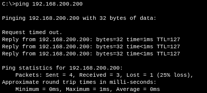

# SAE-21 - Petits Réseaux

## Table des matières

- [SAE-21 - Petits Réseaux](#sae-21---petits-réseaux)
  - [Table des matières](#table-des-matières)
  - [Preface](#preface)
  - [Schéma Réseau](#schéma-réseau)
  - [Architecture](#architecture)
    - [Choix de réseaux](#choix-de-réseaux)
    - [Choix des éléments physiques](#choix-des-éléments-physiques)
      - [Choix des liens physiques](#choix-des-liens-physiques)
    - [Choix des protocoles et de la sécurité](#choix-des-protocoles-et-de-la-sécurité)
      - [Choix des protocoles](#choix-des-protocoles)
      - [Choix de la sécurité](#choix-de-la-sécurité)
    - [Spécificités du Routage BGP](#spécificités-du-routage-bgp)
  - [Spécificités techniques](#spécificités-techniques)
    - [Spécificités réseau interne vlan 10](#spécificités-réseau-interne-vlan-10)
    - [Spécificités réseau interne vlan 20](#spécificités-réseau-interne-vlan-20)
    - [Spécificités réseau interne vlan 30](#spécificités-réseau-interne-vlan-30)
    - [Spécificités réseau interne vlan 200](#spécificités-réseau-interne-vlan-200)
    - [Spécificités réseau DMZ](#spécificités-réseau-dmz)
    - [Spécificités réseau DMZ PC technique](#spécificités-réseau-dmz-pc-technique)
    - [Spécificités réseaux FAI](#spécificités-réseaux-fai)
      - [Spécificités réseau FAI Entreprise](#spécificités-réseau-fai-entreprise)
      - [Spécificités réseau FAI Site Distant 1](#spécificités-réseau-fai-site-distant-1)
      - [Spécificités réseau FAI Site Distant 2](#spécificités-réseau-fai-site-distant-2)
    - [Spécificités réseaux Sites Distants](#spécificités-réseaux-sites-distants)
      - [Spécificités réseau Site Distant 1](#spécificités-réseau-site-distant-1)
      - [Spécificités réseau Site Distant 2](#spécificités-réseau-site-distant-2)
  - [Configurations](#configurations)
    - [Configuration d'un switch](#configuration-dun-switch)
    - [Configuration d'un routeur](#configuration-dun-routeur)
      - [Configuration du routeur interne / DMZ](#configuration-du-routeur-interne--dmz)
        - [Configuration du DHCP](#configuration-du-dhcp)
        - [Configuration des ACLs](#configuration-des-acls)
        - [Configuration du NAT](#configuration-du-nat)
        - [Configuration du VPN](#configuration-du-vpn)
  - [Tests de fonctionnement](#tests-de-fonctionnement)
    - [Test du VLAN 10](#test-du-vlan-10)
    - [Test du VLAN 20](#test-du-vlan-20)
    - [Test du VLAN 30](#test-du-vlan-30)
    - [Test de la DMZ](#test-de-la-dmz)
      - [Test du PC technique de la DMZ](#test-du-pc-technique-de-la-dmz)
    - [Test du serveur DNS de la DMZ](#test-du-serveur-dns-de-la-dmz)
    - [Test du VPN](#test-du-vpn)
  - [Cahier des charges:](#cahier-des-charges)
  - [Copyright © 2023 Alexis Opolka - All Rights Reserved](#copyright--2023-alexis-opolka---all-rights-reserved)


## Preface

Avant tout, vu que je suis étudiant-entrepreneur,
j'ai décidé de réfléchir à l'architecture réseau et
autres éléments de la manière la plus sérieuse et réaliste
possible. En me disant que ce que je faisais ici pourrait
très bien être le réseau de mon entreprise, si mon projet
aboutit.

Ainsi, le nom de l'entreprise est le nom de mon projet,
`The Banzaii Project`, et les choix d'architecture réseaux,
physique et sécuritaire sont fait en se projettant dans
quelques années.

## Schéma Réseau


## Architecture

Le cahier des charges que vous pouvez voir [en fin de compte-rendu](#cahier-des-charges) comporte:

- Un réseau interne contenant 3 services (commercial, administratif et technique)
- Un réseau DMZ contenant un serveur Web et un serveur DNS
- Un réseau opérateur ou FAI
- Deux sites délocalisés

En plus de ça, j'ai ajouté un réseau faisant office de lien Internet.

Pour plus de lisibilité durant la simulation, j'ai aussi
clusterisé les réseaux, ce qui nous donne ce schéma à la racine du projet:


### Choix de réseaux

Pour les réseaux et les VLANs, j'ai choisi de faire des démarcations bien distinctes:

|         Dénomination du Réseau          | VLAN  | Adresse réseau/Masque | Gateway par défaut |                                                                     Description                                                                     |
| :-------------------------------------: | :---: | :-------------------: | :----------------: | :-------------------------------------------------------------------------------------------------------------------------------------------------: |
|   Réseau interne - Service Commercial   |  10   |    192.168.10.0/24    |   192.168.10.254   |                      VLAN du service commercial, pour plus d'informations, [cliquez ici](#spécificités-réseau-interne-vlan-10)                      |
| Réseau interne - Service Administratif  |  20   |    192.168.20.0/24    |   192.168.20.254   |                    VLAN du service administratif, pour plus d'informations, [cliquez ici](#spécificités-réseau-interne-vlan-20)                     |
|   Réseau interne - Service Technique    |  30   |    192.168.30.0/24    |   192.168.30.254   |                      VLAN du service technique, pour plus d'informations, [cliquez ici](#spécificités-réseau-interne-vlan-30)                       |
|   Réseau interne - Services Internes    |  200  |   192.168.200.0/24    |  192.168.200.254   |                     VLAN des services internes, pour plus d'informations, [cliquez ici](#spécificités-réseau-interne-vlan-200)                      |
|               Réseau DMZ                |  N/A  |      200.0.0.0/8      |   200.0.255.254    |                                    Réseau DMZ, pour plus d'informations, [cliquez ici](#spécificités-réseau-dmz)                                    |
|        Réseau DMZ - PC technique        |  N/A  |    200.0.200.0/24     |        N/A         |                       PC technique de la DMZ, pour plus d'informations, [cliquez ici](#spécificités-réseau-dmz-pc-technique)                        |
|   Réseau FAI - Entreprise / Core Node   |  N/A  |   10.200.202.200/30   |        N/A         |     Lien entre l'entreprise et le coeur du réseau de l'opérateur, pour plus d'informations, [cliquez ici](#spécificités-réseau-fai-entreprise)      |
| Réseau FAI - Site Distant 1 / Core Node |  N/A  |   10.202.202.200/30   |        N/A         | Lien entre le site distant 1 et le coeur du réseau de l'opérateur, pour plus d'informations, [cliquez ici](#spécificités-réseau-fai-site-distant-1) |
| Réseau FAI - Site Distant 2 / Core Node |  N/A  |   10.202.201.200/30   |        N/A         | Lien entre le site distant 2 et le coeur du réseau de l'opérateur, pour plus d'informations, [cliquez ici](#spécificités-réseau-fai-site-distant-2) |
|         Réseau Site Distant n°1         |  N/A  |    192.168.1.0/24     |   192.168.1.254    |                  Le réseau privé du site distant n°1, pour plus d'informations, [cliquez ici](#spécificités-réseau-site-distant-1)                  |
|         Réseau Site Distant n°2         |  N/A  |    192.168.2.0/24     |   192.168.2.254    |                  Le réseau privé du site distant n°2, pour plus d'informations, [cliquez ici](#spécificités-réseau-site-distant-2)                  |

### Choix des éléments physiques

| Dénomination de l'élément |    Réf./ID    |                    Avantages                     |                             Inconvénients                             |                                                                   Raison du choix                                                                   |
| :-----------------------: | :-----------: | :----------------------------------------------: | :-------------------------------------------------------------------: | :-------------------------------------------------------------------------------------------------------------------------------------------------: |
|          Switch           |   Switch-PT   |   Permet jusqu'à 10 connexions Fibres/Cuivres    | Est un modèle générique, ne permet pas de se projeter dans la réalité |                                       Il permet de faire beaucoup de connexions, notamment en fibre optique.                                        |
|          Routeur          |  Cisco 2901   |          Permet de faire du NAT/BGP/VPN          |              N'est pas un routeur de dernière génération              | Il permet de faire, en particulier, une connexion VPN, pour plus d'informations, se référer à la section [création d'un VPN](#configuration-du-vpn) |
|          Routeur          |  Cisco 1841   |        Requis dans le cahier des charges         |                   Requis dans le cahier des charges                   |                                                          Requis dans le cahier des charges                                                          |
|          Routeur          |  Cisco 2811   |        Requis dans le cahier des charges         |                   Requis dans le cahier des charges                   |                                                          Requis dans le cahier des charges                                                          |
|       Lien physique       | Fibre Optique | Permet de faire des connexions à très haut débit |                 Nécessite des équipements spécifiques                 |                                   Se référer à la section [Choix des liens physiques](#choix-des-liens-physiques)                                   |

En interne, j'ai décidé d'ajouter un switch supplémentaire par rapport au cahier des charges,
il se place entre le routeur interne/DMZ et les deux switchs déjà présent.  
Il permet d'avoir un lien "directe" entre les services internes et le routeur, il est pour l'instant
seulement connecté au serveur Web interne et aux switchs mais on peut supposer qu'il y aura d'autres
services internes ou d'autres réseaux à l'avenir, ce qui permet d'avoir une architecture plus évolutive,
certes plus centralisée, mais avec une meilleure scalabilité.


#### Choix des liens physiques

Pour les liens physiques, on peut voir que j'ai choisi d'utiliser de la fibre optiques.  
En effet, la fibre optique, en plus d'obtenir un débit plus élevé, prends de plus en plus
la place du cuivre dans les réseaux, qu'ils soient d'entreprises ou autres.  
Il est donc clair que pour un futur réseau, nous utiliserons presque exclusivement de la fibre optique.
Il faut donc commencer à s'adapter et à faire rentrer dans nos habitudes l'utilisation de la fibre optique.

### Choix des protocoles et de la sécurité

#### Choix des protocoles

Pour le routage dynamique entre les différents réseaux passant par le FAI,
j'ai préféré utiliser du BGP plutôt que tout autre protocole de routage dynamique.  
En effet, pour moi, j'ai trouvé que l'on ne travaillait pas sur différents réseaux
mais plutôt sur différents AS (Autonomous System).
J'ai donc trouvé plus naturel et logique d'utiliser du BGP pour le routage dynamique.

#### Choix de la sécurité

Pour la sécurité, j'ai utilisé plusieurs méthodes, les ACLs et la sécurité par design.

C'est à dire que pour les VLANs, j'ai utilisé des ACLs pour empêcher expressément
certaines connexions de s'effectuer entre les différents VLANs et/ou des sorties.

Mais par exemple, pour la DMZ et l'ordinateur technique de la DMZ, j'ai utilisé
la sécurité par design, c'est à dire que j'ai mis en place un réseau avec un
masque de sous-réseau plus grand que nécessaire, ce qui me permet de jouer
avec les différents octets de l'adresse en fonction de si c'est un serveur
ou un routeur.  
Ensuite, je configure l'adresse IP de l'ordinateur technique avec un
masque de sous-réseau plus grand lui permettant d'accéder aux serveurs
mais pas aux routeurs, ne lui permettant pas de sortir du réseau.

### Spécificités du Routage BGP

|  AS   |  Localisation  |
| :---: | :------------: |
|  100  |   Entreprise   |
|  900  | FAI Core Node  |
|  200  | Site Distant 1 |
|  300  | Site Distant 2 |

## Spécificités techniques

### Spécificités réseau interne vlan 10

| Droit d'accès [YES/NO] |                  Droit en question                   |
| :--------------------: | :--------------------------------------------------: |
|          YES           |             Accès aux services internes              |
|          YES           |                    Accès à la DMZ                    |
|          YES           |                   Accès à Internet                   |
|           NO           | Accès aux autres services (Administratif, Technique) |

Le VLAN 10 du réseau interne est réservé au service commercial.  
Le réseau du VLAN est donc signalé sur le 3ème octet de l'IP,
on a donc `192.168.10.X/24` où `X` est l'hôte (compris entre 1 et 253).  
Sa gateway par défaut est `192.168.10.254` et se trouve sur la sous-interface G0/0/0.10
du routeur interne/DMZ.

### Spécificités réseau interne vlan 20

| Droit d'accès [YES/NO] |                 Droit en question                 |
| :--------------------: | :-----------------------------------------------: |
|          YES           |            Accès aux services internes            |
|          YES           |                  Accès à la DMZ                   |
|          YES           |                 Accès à Internet                  |
|           NO           | Accès aux autres services (Commercial, Technique) |

Le VLAN 20 du réseau interne est réservé au service administratif.  
Le réseau du VLAN est donc signalé sur le 3ème octet de l'IP,
on a donc `192.168.20.X/24` où `X` est l'hôte (compris entre 1 et 253).
Sa gateway par défaut est `192.168.20.254` et se trouve sur la sous-interface G0/0/0.20
du routeur interne/DMZ.

### Spécificités réseau interne vlan 30

| Droit d'accès [YES/NO] |                   Droit en question                   |
| :--------------------: | :---------------------------------------------------: |
|          YES           |              Accès aux services internes              |
|           NO           |                    Accès à la DMZ                     |
|           NO           |                   Accès à Internet                    |
|          YES           | Accès aux autres services (Commercial, Administratif) |

Le VLAN 30 du réseau interne est réservé au service technique.  
Le réseau du VLAN est donc signalé sur le 3ème octet de l'IP,
on a donc `192.168.30.X/24` où `X` est l'hôte (compris entre 1 et 253).
Sa gateway par défaut est `192.168.30.254` et se trouve sur la sous-interface G0/0/0.30
du routeur interne/DMZ.

### Spécificités réseau interne vlan 200

| Droit d'accès [YES/NO] |                     Droit en question                     |
| :--------------------: | :-------------------------------------------------------: |
|           NO           |                      Accès à la DMZ                       |
|           NO           |                     Accès à Internet                      |
|          YES           | Accès aux services (Commercial, Administratif, Technique) |

Le VLAN 200 du réseau interne est réservé aux services internes, c'est à dire
au serveur Web / DNS / etc dans le réseau interne.  
Le réseau du VLAN est donc signalé sur le 3ème octet de l'IP,
on a donc `192.168.200.X/24` où `X` est l'hôte (compris entre 1 et 253).
Sa gateway par défaut est `192.168.200.254` et se trouve sur la sous-interface G0/0/0.200
du routeur interne/DMZ.  
Ce VLAN ne doit pas avoir accès à la DMZ ni à Internet et inversement.  
On ne veut pas que les services internes puissent sortir du réseau interne.

### Spécificités réseau DMZ

Le réseau DMZ est un réseau publique, c'est à dire qu'il est accessible depuis Internet
sans avoir besoin de passer par un NAT.

Il ne comporte pas d'ACLs ni de VLANs, je préfère le laisser le plus simple possible,
techniquement parlant.  
Sur le plan des restrictions d'accès, j'utilise alors ce qui est pour moi,
la meilleure solution, la sécurité par design.  
En effet, au lieu de suivre le cahier des charges et de mettre un masque de sous-réseaux
en `/24`, j'ai décidé de mettre un masque de sous-réseaux en `/8` et ensuite d'augmenter
le masque de sous-réseaux en fonction du besoin.

En jouant ainsi sur le masque, et donc les bits d'adressage, on obtient l'adressage suivant:

|        Fonction        |  Adresse IP   |    Gateway    |
| :--------------------: | :-----------: | :-----------: |
|      Serveur Web       | 200.0.200.80  | 200.0.255.254 |
|      Serveur DNS       | 200.0.200.53  | 200.0.255.254 |
|   Routeur Intern/DMZ   | 200.0.255.200 |      N/A      |
| Routeur Entreprise/FAI | 200.0.255.254 |      N/A      |

On peut voir que les serveurs ont leur 3ème octet qui est différent des routeurs.

### Spécificités réseau DMZ PC technique

Le PC technique de la DMZ est un PC qui doit pouvoir accéder aux serveurs de la DMZ
et les administrer sans jamais pouvoir sortir de la DMZ que ce soit en direction
du serveur interne ou d'Internet.  

Pour cela, sans ACL, on configure l'adresse IP du PC avec un masque de sous-réseaux
en `/24` et une adresse IP du type `200.0.200.X` afin que le PC puisse accéder aux
serveurs mais pas aux routeurs.

### Spécificités réseaux FAI

Les réseaux FAI sont les réseaux qui relient tous les réseaux entre eux.  
Ils ont donc des liens uniques et un masque en `/30` vu le besoin de seulement 2 adresses IP,
une pour le client et une pour le FAI.  
Pour plus de simplicité, j'ai configuré les liens de manière à ce que le client
soit toujours en `.201` et le FAI en `.202`.  
Dû au fait de l'obligation d'utiliser un routeur Cisco 1841, j'ai dû utiliser un lien
en cuivre, faisant des liens FAI les liens les plus lents du réseau.

#### Spécificités réseau FAI Entreprise

|   Réseau/Masque   |  Hôte client   |    Hôte FAI    |
| :---------------: | :------------: | :------------: |
| 10.200.202.200/30 | 10.200.202.201 | 10.200.202.202 |

Le réseau FAI/Entreprise est le réseau qui relie l'entreprise au coeur du réseau de l'opérateur.  

#### Spécificités réseau FAI Site Distant 1

|   Réseau/Masque   |  Hôte client   |    Hôte FAI    |
| :---------------: | :------------: | :------------: |
| 10.202.202.200/30 | 10.202.202.201 | 10.202.202.202 |

Le réseau FAI/Site Distant 1 est le réseau qui relie le site distant 1 au coeur du réseau de l'opérateur.  
Il fait donc office de jonction entre le site distant 1 et l'entreprise.  

#### Spécificités réseau FAI Site Distant 2

|   Réseau/Masque   |  Hôte client   |    Hôte FAI    |
| :---------------: | :------------: | :------------: |
| 10.202.201.200/30 | 10.202.201.201 | 10.202.201.202 |

Le réseau FAI/Site Distant 2 est le réseau qui relie le site distant 2 au coeur du réseau de l'opérateur.  
Il fait donc office de jonction entre le site distant 2 et l'entreprise.

### Spécificités réseaux Sites Distants

On a le 3ème octet de l'IP qui est différent de celui du réseau interne
et des différents VLANs. De préférence, je recommande d'avoir le 3ème octet
incrémenté de 1 par rapport aux VLANs étant incrémentés de 10.

Il ne faut pas oublier que l'on pourra avoir une confusion entre VLANs et
sites distants, donc il faut que les sites distants n'aient pas d'adresses
qui soient multiples de 10.  

#### Spécificités réseau Site Distant 1

| Réseau/Masque  | Hôte client |    Gateway    |
| :------------: | :---------: | :-----------: |
| 192.168.1.0/24 | 192.168.1.1 | 192.168.1.254 |

Le réseau du site distant 1 est le réseau privé du site distant 1.  
Il est relié au réseau interne de l'entreprise via un VPN.  

#### Spécificités réseau Site Distant 2

| Réseau/Masque  | Hôte client |    Gateway    |
| :------------: | :---------: | :-----------: |
| 192.168.2.0/24 | 192.168.2.1 | 192.168.2.254 |

Le réseau du site distant 2 est le réseau privé du site distant 2.  
Il est relié au réseau interne de l'entreprise via un VPN.  

## Configurations

Afin de ne pas surcharger le fichier de compte rendu,
les configurations ne sont pas toutes présentes et ont
été rendues plus générales afin de pouvoir être appliquées
dans d'autres cas.

### Configuration d'un switch

On peut se dire que la configuration d'un switch est assez simple,
et c'est vrai, dans la plupart des cas, en l'occurence ici, on
avait bien une configuration d'un switch assez simple.  
Le plus important étant de bien configurer les liens VLANs et le
lien Trunk de sortie, notre "Gateway physique".

```cisco
interface GigabitEthernet5/1
 switchport access vlan 10
!
interface GigabitEthernet6/1
 switchport mode trunk
!
interface GigabitEthernet7/1
 switchport access vlan 10
!
interface GigabitEthernet8/1
 switchport access vlan 30
!
interface GigabitEthernet9/1
 switchport access vlan 20
!
```

On peut voir que, de décider si un lien est en mode `access` ou `trunk`
ne revient à écrire une seule ligne dans le fichier de configuration
où:

- mode `access` requiert:

   ```bash
    switchport access vlan <VLAN>
   ```

- mode `trunk` requiert:

   ```bash
    switchport mode trunk
   ```

> **Note**:  
> Le fichier de configuration est disponible sur [GitHub](https://github.com/alexis-opolka/sae-21/tree/main/src/configs-cisco-packet-tracer/switch-vlans-trunks.txt)

### Configuration d'un routeur

#### Configuration du routeur interne / DMZ

Récapitulatif des fonctions prises en charge par le routeur:

- NAT
- VPN
- ACLs
- VLANs
- Routage Statique
- DHCP

> **Note**:  
> Le fichier de configuration est disponible sur [GitHub](https://github.com/alexis-opolka/sae-21/blob/07966d032bbd19071bde3cdb44e0e165a87cdf25/src/configs-cisco-packet-tracer/gateway-intern-vpn.txt)

##### Configuration du DHCP

On commence par créer un pool réservé à un réseau:

```cisco
ip dhcp pool vlan1
 network <Adresse-Reseau> <Masque-Sous-Reseau>
 default-router <Gateway-Par-Defaut>
 !-- Optionnel à toute configuration DHCP, il est néanmoins obligatoire si vous voulez
 !-- avoir une résolution de FQDN/DN sur votre réseau.
 dns-server <DNS-Server-IP>
!
```

Si l'on veut donc créer un pool DHCP pour le VLAN 10, du nom
de `vlan1`, avec un serveur DNS par défaut étant celui de la
DMZ, on aura:

```cisco
ip dhcp pool vlan1
 network 192.168.10.0 255.255.255.0
 default-router 192.168.10.254
 dns-server 200.0.200.53
!
```

Ensuite, si l'on veut faire exclure des addresses IP de A à B du pool, on fait:

```cisco
ip dhcp excluded-address <Adresse-IP-A> <Adresse-IP-B>
```

Du coup, si l'on veut exclure les addresses `.253` à `.254`, on ajoute à la configuration, la ligne suivante:

```cisco
ip dhcp excluded-address 192.168.10.253 192.168.10.254
```

##### Configuration des ACLs

On a une seule ACL à configurer, elle s'appelle `VLAN`:

Elle gère toutes les connexions entre nos VLANs et permet
de filtrer ce qui devrait sortir, être Naté ou non.

```cisco
ip access-list extended VLAN
 deny icmp 192.168.10.0 0.0.0.255 192.168.30.0 0.0.0.255 echo
 deny icmp 192.168.10.0 0.0.0.255 192.168.20.0 0.0.0.255 echo
 deny icmp 192.168.20.0 0.0.0.255 192.168.10.0 0.0.0.255 echo
 deny icmp 192.168.20.0 0.0.0.255 192.168.30.0 0.0.0.255 echo
 deny ip 192.168.200.0 0.0.0.255 192.168.1.0 0.0.0.255
 deny ip 192.168.200.0 0.0.0.255 192.168.2.0 0.0.0.255
 permit ip 192.168.200.0 0.0.0.255 any
 permit ip any any
!
```

Un avantage du fait d'avoir du NAT est que l'on a pas besoin
d'expressément bloquer les connexions entrantes vers le VLAN 200
puisque le NAT bloque tout ce qui n'est pas lié à sa table de NAT.  
On a donc pas besoin de bloquer les connexion entrantes vers le VLAN 200
avec des ACLs.

##### Configuration du NAT

Pour le NAT, on a besoin de quatres éléments:

- Une interface interne
- Une interface externe
- Une ACL
- DeNAT ou Source NAT

Sur l'interface interne que l'on veut, on fait:

```cisco
ip nat inside
```

Sur l'interface externe que l'on veut, on fait:

```cisco
ip nat outside
```

Ensuite, on configure une ACL qui va nous permettre de définir
dans quelles conditions on va faire du NAT.

Dans notre cas, c'est l'ACL `VLAN` qui s'en occupe, on a donc pas
besoin de créer une ACL spécifique pour le NAT.

Enfin, pour la question de si on fait du DeNAT ou du Source NAT,
on fait du Source NAT, c'est à dire que l'on va changer l'adresse
source de l'IP de l'expéditeur par celle de l'interface externe
du routeur.

```cisco
ip nat inside source list VLAN interface GigabitEthernet0/1/0 overload
```

##### Configuration du VPN

> **Note**:  
> De par les instructions données comme quoi il était nécessaire
> d'avoir un VPN fonctionnel mais qu'il n'était pas obligatoire
> de l'avoir sur les deux sites distants, j'ai décidé de ne pas
> le mettre en place sur le site distant n°2, me donnant ainsi
> la possibilité de démontrer facilement les connexions avec
> un VPN fonctionnel et sans VPN.

Tout d'abord, j'ai du changer le routeur interne/DMZ par un routeur
Cisco 2901, car le routeur Cisco 2811 qui était imposé dans le cahier
des charges ne supporte pas le VPN, tout du moins dans Packet Tracer.

Ainsi donc, pour configurer le VPN sur un routeur Cisco 2901, on a besoin:

- D'activer le module de sécurité
- De créer un ISAKMP Policy
- De créer un Transform Set
- De créer une clé de chiffrement entre les deux routeurs
- De créer un ACL
- De créer une Carte Crypto

Pour activer le module de sécurité, on fait:

```cisco
license boot module c2900 technology-package securityk9
```

> **Note**:  
> Il faut redémarrer le routeur pour que le module soit activé
> et donc les commandes reconnues et prises en compte.
>
> Pour cela, étant en l'état de super-utilisateur, on fait:
> ```cisco
> reload
> ```
>
> Dans le cas où l'on est dans la configuration, on fait:
> ```cisco
> do reload
> ```

Ensuite, on crée une ISAKMP Policy:

```cisco
crypto isakmp policy 10
 encr aes
 authentication pre-share
 group 5
```

On crée un Transform Set:

```cisco
crypto ipsec transform-set CRYPSET esp-aes esp-sha-hmac
```

On crée une clé de chiffrement

```cisco
crypto isakmp key <Clé> address <Adresse-IP-Routeur-Distant>
```

On crée une ACL:

```cisco
ip access-list extended VPN
 permit ip 192.168.200.0 0.0.0.255 192.168.1.0 0.0.0.255
!
```

Après cela, on doit créer une carte crypto:

```cisco
crypto map VPNMAP 10 ipsec-isakmp
 set peer <Adresse-IP-Routeur-Distant>
 set transform-set CRYPSET
 match address VPN
!
```

Pour finir, on applique la carte crypto sur l'interface externe:

```cisco
crypto map VPNMAP
```

> **Note**:  
> Il ne faut pas oublier de mettre une route par défaut si vous
> constatez que le VPN n'a pas l'air de fonctionner.

## Tests de fonctionnement

### Test du VLAN 10

  - Non accès au VLAN 20 => :white_check_mark:

    ```cmd
    ping 192.168.20.1
    ```

    

  - Non accès au VLAN 30 => :white_check_mark:

    ```cmd
    ping 192.168.30.1
    ```

    

  - Accès au VLAN 200 => :white_check_mark:

    ```cmd
    ping 192.168.200.200
    ```

    

  - Accès à la DMZ => :white_check_mark:

    ```cmd
    ping 200.0.200.80
    ```

    

  - Accès à Internet => :white_check_mark:

    ```cmd
    ping 8.8.8.8
    ```

    

### Test du VLAN 20

  - Non accès au VLAN 10 => :white_check_mark:

    ```cmd
    ping 192.168.10.1
    ```

    

  - Non accès au VLAN 30 => :white_check_mark:

    ```cmd
    ping 192.168.30.1
    ```

    

  - Accès au VLAN 200 => :white_check_mark:

    ```cmd
    ping 192.168.200.200
    ```

    


  - Accès à la DMZ => :white_check_mark:

    ```cmd
    ping 200.0.200.80
    ```

    

  - Accès à Internet => :white_check_mark:

    ```cmd
    ping 8.8.8.8
    ```

    

### Test du VLAN 30

  - Accès au VLAN 10 => :white_check_mark:

    ```cmd
    ping 192.168.10.1
    ```

    

  - Accès au VLAN 20 => :white_check_mark:

    ```cmd
    ping 192.168.20.1
    ```

    

  - Accès au VLAN 200 => :white_check_mark:

    ```cmd
    ping 192.168.200.200
    ```

    

  - Non accès à la DMZ => :white_check_mark:

    ```cmd
    ping 200.0.200.80
    ```

    

  - Non accès à Internet => :white_check_mark:

    ```cmd
    ping 8.8.8.8
    ```

    

### Test de la DMZ

  - Est accessible par Internet => :white_check_mark:

    ```cmd
    ping 200.0.255.254
    ```

    

  - Serveur Web accessible par Internet => :white_check_mark:

    ```cmd
    ping 200.0.200.80
    ```

    

  - Serveur DNS accessible par Internet => :white_check_mark:

    ```cmd
    ping 200.0.200.53
    ```

    

#### Test du PC technique de la DMZ

  - Accès au serveur Web => :white_check_mark:

    ```cmd
    ping 200.0.200.80
    ```

    

  - Accès au serveur DNS => :white_check_mark:

    ```cmd
    ping 200.0.200.53
    ```

    

  - Non accès à la Gateway => :white_check_mark:

    ```cmd
    ping 200.0.255.254
    ```

    

  - Non accès à la Gateway Interne => :white_check_mark:

    ```cmd
    ping 200.0.255.200
    ```

    

  - Non accès à Internet => :white_check_mark:

    ```cmd
    ping 8.8.8.8
    ```

    

  - Non accessible depuis Internet => :white_check_mark:

    ```cmd
    ping 200.0.200.1
    ```

    

### Test du serveur DNS de la DMZ

  - Accessible depuis Internet => :white_check_mark:

    Pour cela, on utilise le FQDN `www.the-banzaii-project.fr` dans
    le navigateur internet du PC du site distant 1.

    

    Si on fait la même action sur le site distant 2, où le VPN n'est pas
    actif, et que la requête traverse le réseau opérateur, on obtient:

    

### Test du VPN

On va utiliser le PC du Site distant 1 car il est le seul à avoir
le VPN configuré et actif.

  - Accès à la DMZ => :white_check_mark:

    ```cmd
    ping 200.0.200.80
    ```

    

  - Accès à Internet => :white_check_mark:

    ```cmd
    ping 8.8.8.8
    ```

    

  - Accès au serveur interne => :white_check_mark:

    ```cmd
    ping 192.168.200.200
    ```

    

  - Accès à la résolution de FQDN => :white_check_mark:

    On utilise le navigateur internet du PC du site distant 1
    pour accéder au FQDN `beta.the-banzaii-project.fr`.

    

    Si l'on essaie avec le PC du site distant 2, on obtient:

    

    Ce qui nous montre que le VPN fonctionne bien.

## Cahier des charges:

- [x] ACLs
  - [x] Service commercial (VLAN 10)
    - [x] Accès au serveur interne
    - [x] Accès à la DMZ
    - [x] Accès à Internet
    - [x] Pas accès aux autres services internes
  - [x] Service administratif (VLAN 20)
    - [x] Accès au serveur interne
    - [x] Accès à la DMZ
    - [x] Accès à Internet
    - [x] Pas accès aux autres services internes
  - [x] Service technique (VLAN 30)
    - [x] Accès à tous les services internes
    - [x] Ne doit pas pouvoir sortir du réseau Internet
- [x] DMZ
  - [x] Addressage IP publique en 200.0.0.0/24
  - [x] Serveur Web
    - [x] Accessible depuis Internet
    - [x] Contient une page d'acceuil de l'entreprise
  - [x] Serveur DNS
    - [x] Serveur d'autorité de Nom
    - [x] Accessible depuis Internet
- [x] Choisir un nom pour l'entreprise
- [x] Réseau Interne
  - [x] NAT sur le routeur Interne-DMZ
  - [x] Addresses privées sur le réseau (ne doivent pas pouvoir sortir)
  - [x] 3 services
    - [x] Service commercial (VLAN 10)
    - [x] Service administratif (VLAN 20)
    - [x] Service technique (VLAN 30)
    - [x] Services internes (VLAN 200) -> représenté par le serveur Web interne
  - [ ] Accès au réseau interne via des VPN pour les sites délocalisés
    - [X] Accès VPN du site délocalisé 1
    - [ ] Accès VPN du site délocalisé 2
  - [x] Serveur DHCP interne en fonction des VLANs
    - [x] Création des pools d'adresses IP
      - [x] VLAN 10
        - [x] Référencement
          - [x] DNS interne
          - [x] Gateway par défaut
      - [x] VLAN 20
        - [x] Référencement
          - [x] DNS interne
          - [x] Gateway par défaut
      - [x] VLAN 30
        - [x] Référencement
          - [x] DNS interne
          - [x] Gateway par défaut
      - [x] VLAN 200
        - [x] Gateway par défaut
- [x] Sites délocalisés
  - [x] Accès DMZ
  - [x] Accès Internet
  - [x] VPN: Accès réseau interne
- [x] Internet
  - [x] Être accessible par tout le monde
  - [x] Accès à la DMZ
  - [x] Pas accès au réseau interne
  - [x] Pas accès au réseau des sites délocalisés
- [x] Interconnexion et Routage
  - [x] Mise en place d'une solution de routage dynamique
    - [x] BGP (AS: 100, 200, 300, 900)

## Copyright &copy; 2023 Alexis Opolka - All Rights Reserved
